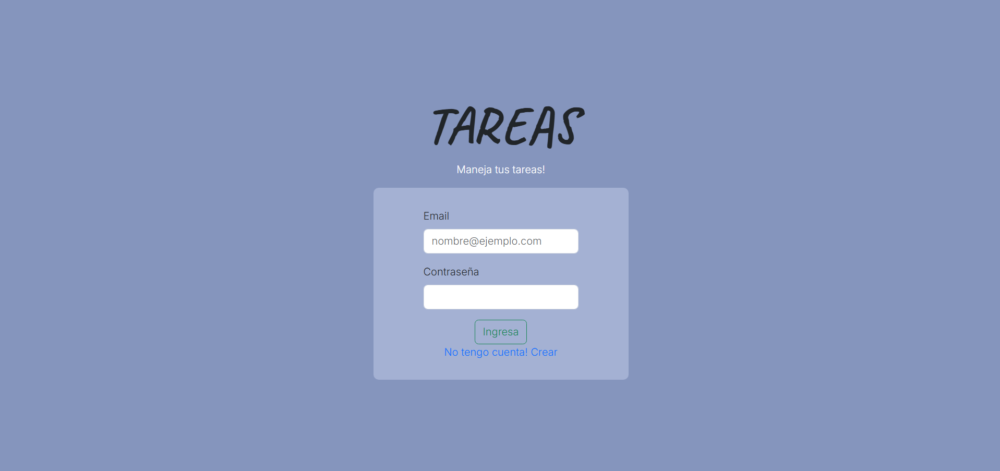
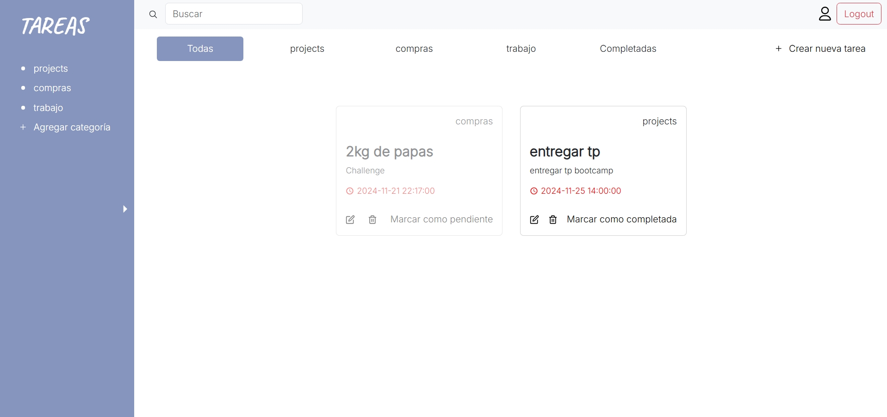
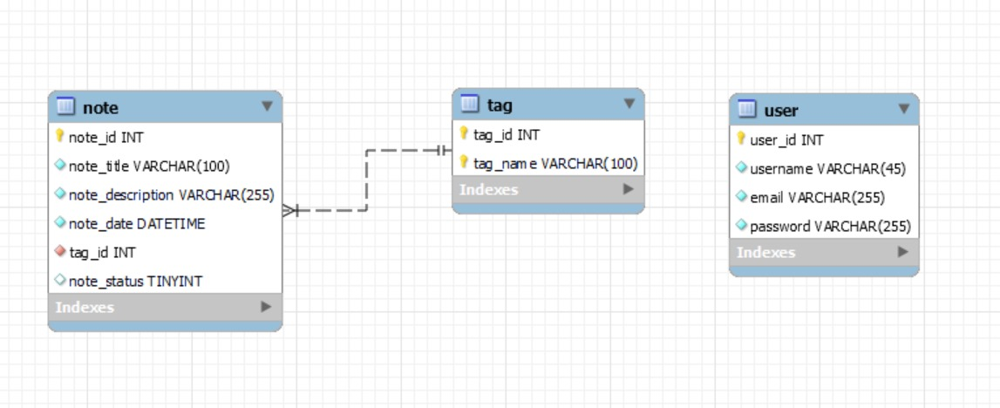

# Trabajo-Final-CILSA

## EER Diagram

## Descripción

## Tecnologías

List of technologies used in the project:
* [React + Vite](https://vitejs.dev/guide/)
* [Bootstrap](https://getbootstrap.com/)
* Node.js
* Express.js
* MySQL

## Version

* Node: v20.9.0
* npm: 7.24.2
* npm list: 
├── @types/react-dom@18.2.18 
├── @types/react@18.2.47 
├── @vitejs/plugin-react@4.2.1 
├── bootstrap@5.3.2 
├── date-fns@3.2.0 
├── eslint-plugin-react-hooks@4.6.0 
├── eslint-plugin-react-refresh@0.4.5 
├── eslint-plugin-react@7.33.2 
├── eslint@8.56.0 
├── moment@2.30.1 
├── react-bootstrap@2.9.2 
├── react-dom@18.2.0 
├── react-icons@5.0.0 
├── react-router-dom@6.21.2 
├── react@18.2.0 
└── vite@5.0.11 

## Commands

Commands to run the application locally:

* FrontEnd: npm run dev.

* BackEnd: npm start.

